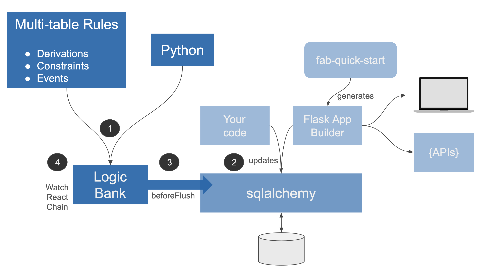
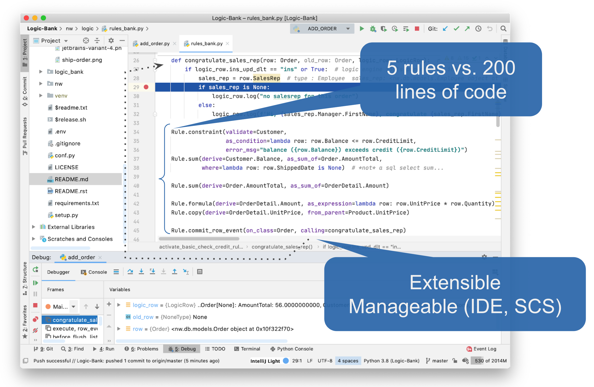

Use Logic Bank to govern SQLAlchemy
update transaction logic - multi-table derivations, constraints,
and actions such as sending mail or messages. Logic consists of:

* **Rules - 40X** more concise
using a spreadsheet-like paradigm, and

* **Python - control and extensibility,**
using standard functions and event handlers


Features
--------

Logic Bank is:

- **Extensible:** logic consists of rules (see below), plus standard Python code

- **Multi-table:** rules like `sum` automate multi-table transactions

- **Scalable:** rules are automatically pruned and optimized; for example, sums are processed as *1 row adjustment updates,* rather than expensive SQL aggregate queries

- **Manageable:** develop and debug your rules in IDEs, manage it in SCS systems (such as `git`) using existing procedures


Since transaction logic is a significant aspect of development,
Logic Bank can return meaningful savings in time and cost. 
[**See the Logic Bank Overview**](../../wiki/Home) for more
on the Business Case, and a detailed walk-through.

Skeptical?  You should be.  Choosing an automation
technology ill-suited to transaction processing has
serious implications for performance, quality and manageability.
Unlike familiar rules engines, Logic Bank rules are specifically
designed to be **scalable and extensible**,
and have been **proven in practice** -
[**see Rules Engines**](../../wiki/Rules-Engines).


## Architecture
<figure></figure>


 1. **Declare** logic as Python functions (see example below).

 2. Your application makes calls on `sqlalchemy` for inserts, updates and deletes.

    - By bundling transaction logic into sqlalchemy data access, your logic
  is automatically shared, whether for hand-written code (Flask apps, APIs)
  or via generators such as Flask AppBuilder.

 3. The **Logic Bank** engine handles sqlalchemy `before_flush` events on
`Mapped Tables`

 4. The logic engine operates much like a spreadsheet:
    -  **watch** for changes at the attribute level
    -  **react** by running rules that referenced changed attributes,
which can
    - **chain** to still other attributes that refer to
_those_ changes.  Note these might be in different tables,
providing automation for _multi-table logic_.

Logic does not apply to updates outside SQLAlchemy,
nor to SQLAlchemy batch updates or unmapped sql updates.


## Declaring Logic as Spreadsheet-like Rules
To illustrate, let's use an adaption
of the Northwind database,
with a few rollup columns added.
For those not familiar, this is basically
Customers, Orders, OrderDetails and Products,
as shown in the diagrams below.

##### Install the Logic Bank
```
pip install -i https://test.pypi.org/simple/ logic-bank
```

##### Declare rules using Python
Logic is declared as spreadsheet-like rules as shown below
from  [`nw/logic/rules_bank.py`](nw/logic/rules_bank.py),
which implements the *check credit* requirement:
<figure></figure>

The specification is fully executable, and governs around a
dozen transactions.  Let's look at **Add Order (Check Credit) -**
enter an Order / OrderDetails,
and rollup to AmountTotal / Balance to check CreditLimit.

This representatively complex transaction illustrates
common logic execution patterns, described below.

##### Activate Rules
To test our rules, we use
[`nw/logic_tests/add_order.py`](nw/tests/add_order.py).
It activates the rules using this import:
```python
from nw.logic import session  # opens db, activates logic listener <--
```
 
This executes [`nw/logic/__init__.py`](nw/logic/__init__.py),
which sets up the rule engine:
```python
by_rules = True  # True => use rules, False => use hand code (for comparison)
if by_rules:
    rule_bank_setup.setup(session, engine)     # setup rules engine
    activate_basic_check_credit_rules()        # loads rules above
    rule_bank_setup.validate(session, engine)  # checks for cycles, etc
else:
    # ... conventional after_flush listeners (to see rules/code contrast)
```
This is what replaces 200 lines of [conventional code.](../../wiki/by-code)
Let's see how it operates.

## Logic Execution: Add Order - Watch, React, Chain

<figure><figcaption>The <b>Add Order</b> example illustrates chaining as OrderDetails are added:
</figcaption></figure>

Let's see how __Watch / React / Chain__ operates to
check the balance when adding an order:

1. The `OrderDetail.UnitPrice` is referenced from the Product
so it is copied

1. OrderDetails are referenced by the Orders' `AmountTotal` sum rule,
so `AmountTotal` is adjusted

1. The `AmountTotal` is referenced by the Customers' `Balance`,
so it is adjusted

1. And the Credit Limit constraint is checked 
(exceptions are raised if constraints are violated)

All of the dependency management to see which attribute have changed,
logic ordering, the SQL commands to read and adjust rows, and the chaining
are fully automated by the engine, based solely on the rules above.
See the [detail walk-through here](../../wiki/Rules-Enginesi#example-add-order---multi-table-adjustment-chaining)

Reuse over Use Cases is automatic, so the same rules
automate deleting and updating orders.
This is how 5 rules represent the same logic as 200 lines of code.

To see more on how __watch__, __react__ and __chain__ 
logic automates and optimizes multi-table transactions,
[click here](../../wiki/Rules-Engines#multi-table-logic-execution).


## An Agile Perspective
The core tenant of agile is _working software,_
driving _collaboration,_ for _rapid iterations._
Here's how rules can help.

##### Working Software _Now_
The examples above illustrate how just a few rules can replace 
[pages of code](../../wiki/by-code).

##### Collaboration - Running Screens

Certainly business users are more easily able to
read rules than code.  But still, rules are
pretty abstract.

Business users relate best to actual working pages -
_their_ interpretation of working software.
The [fab-quick-start](https://github.com/valhuber/fab-quick-start/wiki)
project enables you to build a basic web app in minutes.


<figure></figure>

This project has already generated such an app, which you can run like this:

```
cd nw_app
export FLASK_APP=app
flask run
```

Login: user = admin, password = p

You can
1. Navigate to Order 11011
2. Change the Shipped Date
    * The app has been [configured](../../wiki/Flask-App-Builder-Integration) to activate the rules
    * The logic for this update is interesting, [explored here](../../wiki/home#example-ship-order---pruning-adjustment-and-cascade)

##### Iteration - Automatic Ordering
Rules are _self-organizing_ - they recognize their interdependencies,
and order their execution and database access (pruning, adjustments etc)
accordingly.  This means:

* order is independent - you can state the rules in any order
and get the same result

* maintenance is simple - just make changes, additions and deletions,
the engine will reorganize execution order and database access, automatically


## Installation
TL;DR - using your IDE or command line: 
```
git fork / clone
cd Logic-Bank
virtualenv venv
source venv/bin/activate
pip install -r requirements.txt
```

Logic Bank consists of 2 project repositories:
`Logic Bank` (this project), and `Logic Bank Examples.`
They have a number of elements in common:

* They both have copies of two test database systems - `nw` and `banking`;
these both contain

    * [Databases](nw/db) sqlite - no install required

    * [Test folders](nw/tests) than run key transactions - just run the scripts
(note the logs)

    * [Flask AppBuilder apps](nw/basic_web_app) (as described above)
    
    * [Logic](nw/logic) - models and rules (and, for `'nw',
    the manual code for contrast to rules)
    
* The `nw` sample illustrates comparisons of Business logic, both
[by code](../../wiki/by-code) and by rules (shown above).

They differ in how the logic engine is installed:
* `Logic Bank` - this project

    * Includes Logic Bank source code and documentation
    
    * Click [here](../../wiki/Explore-Logic-Bank)
    for install / operations procedures
    
    * Click [here](../../wiki/Logic-Walkthrough) for a
    short overview of internal logic execution
    
* `Logic Bank Examples` - [here](../../wiki/Sample-Project---Setup)

    * Install instructions for creating your own projects


##### Status: Running, Under Development
Functionally complete, 9/29/2020, tested for 2 databases.

Incubation - ready to explore and provide feedback
on general value, and features.
